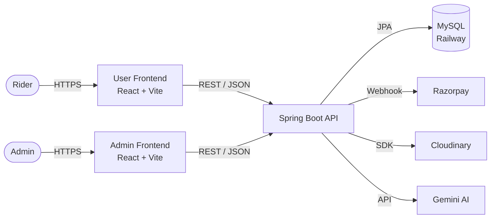
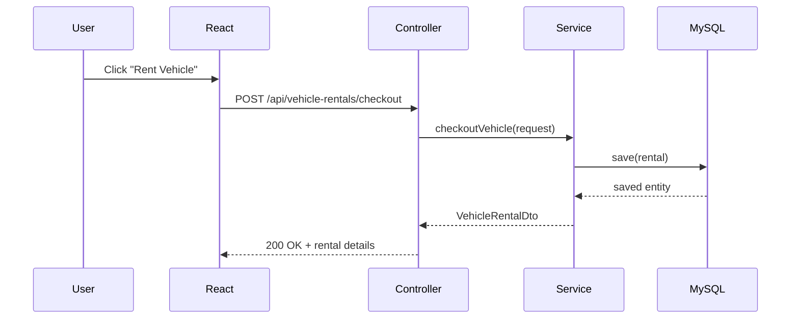

# Safar Setu — Vehicle Rental Management System

**Safar Setu** is a full-stack vehicle rental management platform that brings together fleet management, subscription billing, smart reservations, Razorpay payments, and AI assistance into one seamless experience — built for both admins and riders.

<p align="center">
  <a href="https://safarsetu.pixly.space" target="_blank">
    
  </a>
</p>

> The backend is hosted on ***Render's free tier***, which spins down after inactivity. Your **first request may take a moment** while the server wakes up.

> ***Subsequent requests will be fast*** once the service is running. Just wait a moment and try again if something doesn't load right away.

---

## Table of Contents

- [Overview](#overview)
- [Live Deployment](#live-deployment)
- [Key Technologies](#key-technologies)
- [Architecture](#architecture)
- [Features](#features)
- [Screenshots](#screenshots)
- [API Endpoints](#api-endpoints)
- [Backend Setup](#backend-setup)
- [Frontend Setup](#frontend-setup)
- [Environment Variables](#environment-variables)
- [Contact](#contact)

---

## Overview

Safar Setu is designed to solve real-world vehicle rental challenges — from fleet management and subscription billing to queue-based reservations and AI-powered support. It features a Spring Boot REST API backend, two React frontends (user & admin), JWT + OAuth2 authentication, Razorpay payment integration, and Docker-based deployment.


---

## Live Deployment

| App | URL |
|---|---|
| 🌐 User Frontend | [safarsetu.pixly.space](https://safarsetu.pixly.space) |
| 🛠 Admin Panel | [safarsetuadmin.pixly.space](https://safarsetuadmin.pixly.space) |
| ⚙️ Backend API | [backend.railway.app]() |

---

## Key Technologies

| Layer | Technology |
|---|---|
| Backend | Java 17, Spring Boot 3, Spring Security, Spring Data JPA |
| Frontend | React 19, Vite, Material UI, Tailwind CSS |
| Database | MySQL 8 (Railway), Hibernate ORM |
| Auth | JWT, Google OAuth2, GitHub OAuth2 |
| Payments | Razorpay (*Test Mode*) |
| AI | Google Gemini API (Saathi AI) |
| Storage | Cloudinary |
| DevOps | Docker, Docker Compose, Docker Hub |
| Deployment | Railway (backend), Vercel (frontend) |

---

## Architecture

### System Overview



### Request Lifecycle



---

## Features

### User App
- 🔐 JWT Auth + Google & GitHub OAuth2
- 🚗 Browse & filter vehicles by category, availability, createdAt
- 📋 Queue-based vehicle reservations
- 💳 Subscription plans with Razorpay payments
- 🧾 Active rentals tracking with due dates
- 🤖 Saathi AI assistant for support
- 👤 Profile management with Cloudinary image upload

### Admin Panel
- 📊 Dashboard with stats and activity feed
- 🚘 Full vehicle & category CRUD
- 📦 Subscription plan management
- 🔄 Rental management — return, damage, lost
- 📋 Reservation fulfillment queue
- 👥 User management

---

## Screenshots

<p align="center">
  <a target="_blank">
    
  </a>
  <a  target="_blank">
    
  </a>
  <a target="_blank">
    
  </a>
  <a target="_blank">
    
  </a>
  <a target="_blank">
    
  </a>
</p>


---

## API Endpoints

### Auth
| Method | Endpoint | Description |
|---|---|---|
| POST | `/auth/login` | Login with email/password |
| POST | `/auth/register` | Register new user |
| GET | `/oauth2/authorization/google` | Google OAuth login |
| GET | `/oauth2/authorization/github` | GitHub OAuth login |

### Vehicles
| Method | Endpoint | Description |
|---|---|---|
| GET | `/api/vehicle/search` | Get all vehicles with filters |
| POST | `/api/admin/vehicle` | Add new vehicle |
| PUT | `/api/admin/vehicle/{id}` | Update vehicle |
| DELETE | `/api/admin/vehicle/{id}` | Delete vehicle |

### Rentals
| Method | Endpoint | Description |
|---|---|---|
| POST | `/api/vehicle-rentals/checkout` | Checkout a vehicle |
| POST | `/api/vehicle-rentals/checkin` | Return a vehicle |
| POST | `/api/vehicle-rentals/search` | Search rentals |

### Subscriptions
| Method | Endpoint | Description |
|---|---|---|
| GET | `/api/subscriptions` | Get all plans |
| POST | `/api/subscriptions/subscribe` | Subscribe to a plan |
| GET | `/api/subscriptions/active` | Get active subscription |

### Payments
| Method | Endpoint | Description |
|---|---|---|
| POST | `/api/payment/initiate` | Initiate Razorpay payment |
| POST | `/api/payment/verify` | Verify payment status |

---

## Backend Setup

### 1. Prerequisites
- Java 17+
- Maven 3.9+
- MySQL 8

### 2. Clone the Repository
```bash
git clone https://github.com/vaishnavgupta/Safar-Setu-Vehicle-Rental-Management.git
cd safarsetu/safarsetu
```

### 3. Configure Environment

Create `application-local.properties` in `src/main/resources/`:
```properties
DB_URL=jdbc:mysql://localhost:3306/safarsetu
DB_USERNAME=root
DB_PASSWORD=yourpassword
JWT_SECRET=yoursecretkey
GOOGLE_CLIENT_ID=xxx
GOOGLE_CLIENT_SECRET=xxx
GITHUB_CLIENT_ID=xxx
GITHUB_CLIENT_SECRET=xxx
RAZORPAY_ID=rzp_test_xxx
RAZORPAY_SECRET=xxx
RAZORPAY_CALLBACK=http://localhost:8080
CLOUDINARY_CLOUD_NAME=xxx
CLOUDINARY_API_KEY=xxx
CLOUDINARY_API_SECRET=xxx
GEMINI_API_KEY=xxx
FRONTEND_URL_USER=http://localhost:5173
FRONTEND_URL_ADMIN=http://localhost:5174
DEF_ADMIN_EMAIL=admin@safarsetu.com
DEF_ADMIN_PASSWORD=adminpass
```

### 4. Run
```bash
mvn spring-boot:run -Dspring-boot.run.profiles=local
```

Backend runs at `http://localhost:8080`

---

## Frontend Setup

### 1. Clone & Install
```bash
# User frontend
cd safarsetu-frontend
npm install

# Admin frontend
cd safarsetu-admin-frontend
npm install
```

### 2. Configure Environment

Create `.env` in each frontend folder:
```env
VITE_API_BASE_URL=http://localhost:8080
```

### 3. Run
```bash
npm run dev
```

| App | URL |
|---|---|
| User Frontend | `http://localhost:5173` |
| Admin Frontend | `http://localhost:5174` |

---

## Environment Variables

| Variable | Description |
|---|---|
| `DB_URL` | MySQL JDBC URL |
| `DB_USERNAME` | Database username |
| `DB_PASSWORD` | Database password |
| `JWT_SECRET` | JWT signing secret |
| `GOOGLE_CLIENT_ID` | Google OAuth client ID |
| `GOOGLE_CLIENT_SECRET` | Google OAuth client secret |
| `GITHUB_CLIENT_ID` | GitHub OAuth client ID |
| `GITHUB_CLIENT_SECRET` | GitHub OAuth client secret |
| `RAZORPAY_ID` | Razorpay key ID |
| `RAZORPAY_SECRET` | Razorpay key secret |
| `RAZORPAY_CALLBACK` | Razorpay callback base URL |
| `CLOUDINARY_CLOUD_NAME` | Cloudinary cloud name |
| `CLOUDINARY_API_KEY` | Cloudinary API key |
| `CLOUDINARY_API_SECRET` | Cloudinary API secret |
| `GEMINI_API_KEY` | Google Gemini API key |
| `FRONTEND_URL_USER` | User frontend URL (for CORS) |
| `FRONTEND_URL_ADMIN` | Admin frontend URL (for CORS) |
| `DEF_ADMIN_EMAIL` | Default admin email |
| `DEF_ADMIN_PASSWORD` | Default admin password |

---

## Contact

Built with ❤️ by **Vaishnav Gupta**

- GitHub: [github.com/vaishnavgupta](https://github.com/vaishnavgupta)
- LinkedIn: [linkedin.com/in/vaishnavgupta](https://linkedin.com/in/vaishnavgupta)
- Portfolio: [vaishnav-gupta-portfolio.vercel.app](https://vaishnav-gupta-portfolio.vercel.app)

---

**[⬆ Back to Top](#safarsetu--vehicle-rental-management-system)**
